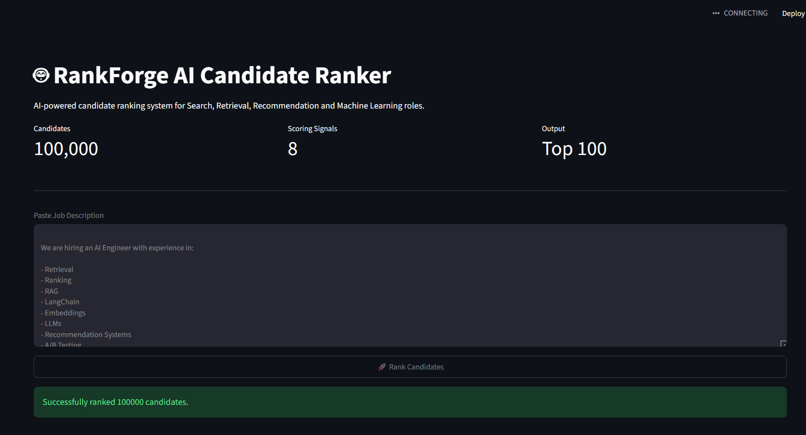
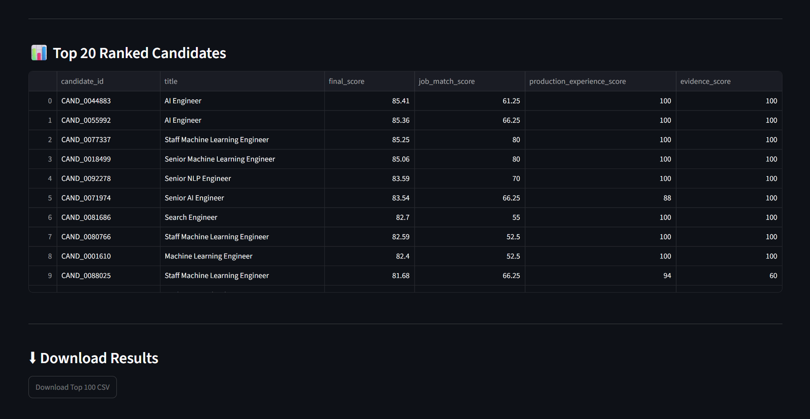
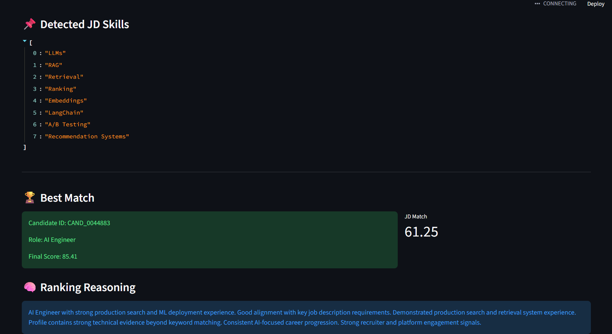

# RankForge AI - Candidate Ranking System

## Redrob Data & AI Challenge Submission

### Author

Lalit Kumar

### Repository

https://github.com/lalitkumar790/redrob-ai-candidate-ranker

---

# Problem Statement

The objective of this challenge is to identify and rank the most suitable candidates for an AI Search and Retrieval role from a pool of approximately 100,000 candidate profiles.

The ranking system must go beyond simple keyword matching and identify candidates with:

* Strong AI and Machine Learning expertise
* Retrieval and Ranking experience
* Search and Recommendation Systems experience
* Production deployment exposure
* Evidence of real-world engineering impact
* Alignment with the target Job Description

---

# Solution Overview

RankForge AI is a multi-factor candidate ranking system that combines technical, behavioral, career and job-alignment signals into a single ranking score.

Instead of relying solely on skills or resume keywords, the system evaluates multiple dimensions of candidate quality.

The final output contains:

* Top 100 ranked candidates
* Ranking score
* Candidate-specific reasoning

---

# System Architecture

Job Description

↓

JD Parser

↓

Candidate Feature Extraction

↓

Scoring Modules

* Technical Score
* Signal Score
* Experience Score
* AI Relevance Score
* Career Credibility Score
* Production Experience Score
* Evidence Score
* JD Match Score

↓

Candidate Ranker

↓

Reasoning Generator

↓

Top 100 Submission

---

# Ranking Methodology

## 1. Technical Score

Evaluates the candidate's technical skills and expertise across AI, ML, Search, Retrieval and Ranking domains.

Purpose:

Identify candidates with strong technical foundations.

---

## 2. Signal Score

Uses recruiter and platform engagement signals available in the dataset.

Purpose:

Capture market interest and profile quality indicators.

---

## 3. Experience Score

Measures depth and duration of professional experience.

Purpose:

Reward proven professional maturity.

---

## 4. AI Relevance Score

Measures alignment with AI-related technologies and roles.

Examples:

* Machine Learning
* Deep Learning
* NLP
* Computer Vision
* LLMs
* RAG
* Embeddings

Purpose:

Promote candidates with strong AI specialization.

---

## 5. Career Credibility Score

Analyzes historical career progression.

Examples:

* AI Engineer
* ML Engineer
* NLP Engineer
* Search Engineer
* Recommendation Systems Engineer

Purpose:

Distinguish genuine AI practitioners from profiles containing isolated AI keywords.

---

## 6. Production Experience Score

Detects evidence of real-world deployment experience.

Examples:

* Search Systems
* Retrieval Pipelines
* Recommendation Engines
* Ranking Systems
* Production ML

Purpose:

Reward candidates who have built and operated production systems.

---

## 7. Evidence Score

Identifies concrete technical evidence rather than keyword frequency.

Examples:

* Retrieval Systems
* Vector Search
* RAG Pipelines
* Search Infrastructure
* Ranking Frameworks

Purpose:

Reduce keyword stuffing and reward demonstrated expertise.

---

## 8. Job Description Match Score

Aligns candidates directly against the target job requirements.

Supported capabilities include:

* Retrieval
* Ranking
* Embeddings
* RAG
* LangChain
* Recommendation Systems
* LLMs
* A/B Testing

Purpose:

Increase ranking precision for the specific role being filled.

---

# Evolution of the Ranking System

The ranking system was developed iteratively.

## Phase 1

Technical and AI relevance scoring.

Issue:

Keyword-heavy profiles were occasionally ranked too highly.

---

## Phase 2

Career Credibility Scoring.

Idea:

Candidates with sustained AI-focused careers should rank higher than candidates with isolated AI skills.

---

## Phase 3

Production Experience Scoring.

Idea:

Reward candidates with experience building production search, retrieval and recommendation systems.

---

## Phase 4

Evidence Scoring.

Idea:

Reward concrete technical evidence instead of keyword frequency.

---

## Phase 5

Job Description Matching.

Idea:

Adapt ranking to specific hiring requirements.

---

## Phase 6

Reasoning Generation.

Idea:

Provide transparent explanations for ranking decisions.

---

# Explainability

Each ranked candidate receives a generated explanation.

Example:

"AI Engineer with strong production search and ML deployment experience. Good alignment with key job description requirements. Demonstrated production search and retrieval system experience. Profile contains strong technical evidence beyond keyword matching."

This improves transparency and recruiter trust.

---

# Output Format

The final submission contains:

* candidate_id
* rank
* score
* reasoning

Only the Top 100 candidates are included.

---

# Running the Project

Generate final submission:

python -m tests.test_submission_generator

Preview final submission:

python -m tests.test_submission_preview

Launch Streamlit Demo:

streamlit run app.py

---

# Deliverables

* Candidate Ranking Engine
* Job Description Parser
* Explainability Module
* Submission Generator
* Streamlit Sandbox Application

---

# Future Improvements

* Learning-to-Rank Models
* Semantic Candidate Retrieval
* Resume Upload Analyzer
* PDF Resume Parsing
* Interactive Recruiter Dashboard
* Candidate Recommendation Explanations

## Dashboard

## Ranking Results

## Candidate Reasoning

